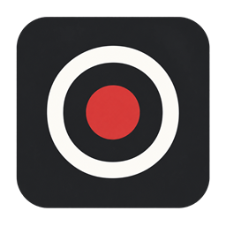

<p align="center">
  
</p>

<h1 align="center">onerec</h1>

<p align="center">
  Your microphone. Your meeting. One MP3.
</p>

A small, portable recorder for **Windows 10+**, built with Rust and a native Win32 interface. Records your microphone and system audio together into a single MP3. No installer required.

- Local audio capture and MP3 encoding.
- Pause/resume, live audio meters, and a configurable global shortcut.
- Five quality profiles, from compact speech recordings to 320 kbps stereo.
- Optional transcription and meeting notes using your own API key.

## Get started

[Download onerec.zip](https://github.com/MonforteGG/onerec/releases), Extract All into a writable folder, and run `onerec.exe` from there. That folder is the app: `onerec.ini` and later updates stay beside the exe.

1. Select your microphone, the output device playing your meeting, and MP3 quality.
2. Click **Record**. Use **Pause** and **Resume** as needed.
3. Click **Stop**, then **Save** to export the MP3.

`Alt+Shift+R` starts and stops recording, even in the background. Change it in Settings. Save your recording before closing; unsaved takes are not recovered on the next launch.

On launch, onerec looks for a newer GitHub Release. If one is available, **Update** downloads the zip, replaces `onerec.exe` in that same folder, and restarts.

Preferences are stored in `onerec.ini` beside the executable.

## Transcription and notes

In Settings, enter your API key, base URL, and transcription/notes model names for an OpenAI-compatible provider. After saving a recording, use **Transcribe** or **Notes** to create Markdown files beside the MP3.

These optional actions send data to your configured provider. Your key is stored in Windows Credential Manager.

## Build

Requires Rust with the Windows MSVC toolchain and Visual Studio C++ Build Tools with the Windows SDK (`rc.exe`).

```powershell
cargo build --release --locked
.\target\release\onerec.exe
```

Run tests with `cargo test --locked`.

## License

[MIT](LICENSE). The bundled LAME encoder is LGPL-licensed; see [NOTICE](NOTICE). Include both files when redistributing the app.
